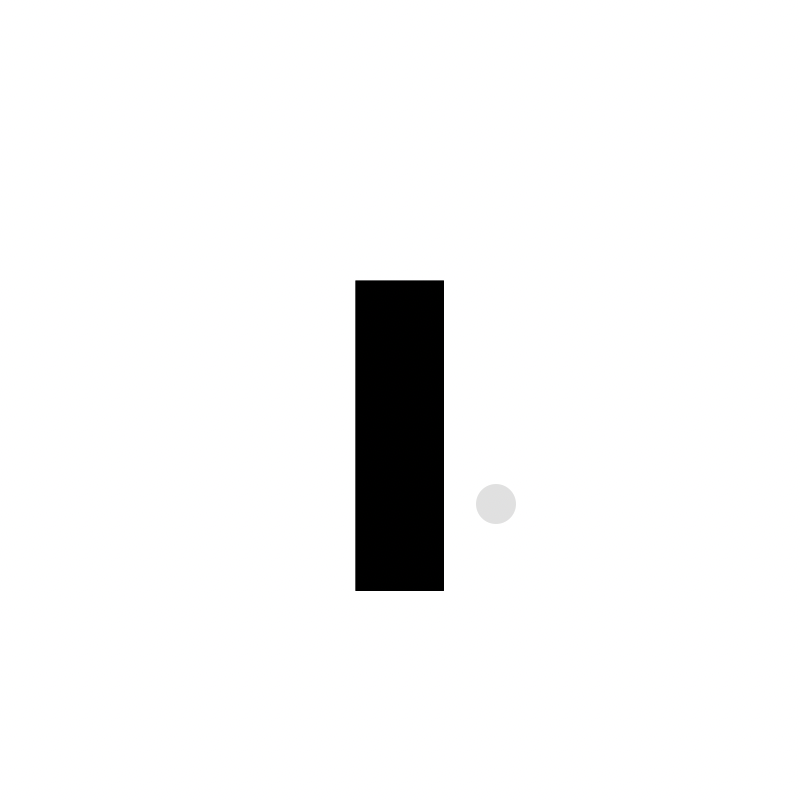

  

<code>laguser / проекты</code>

<h2 align="center">Проекты</h2>

  <code>bastion</code> — VPS hardening · UFW · Fail2Ban · sysctl · SSH 
  <code>ink</code> — minimalist markdown editor 
  <code>recon-pipeline</code> — GitHub Actions recon, WF1–WF5

  Навыки · Контакты · О себе

  Arch · Hyprland · Neovim · Catppuccin Mocha

less is more

